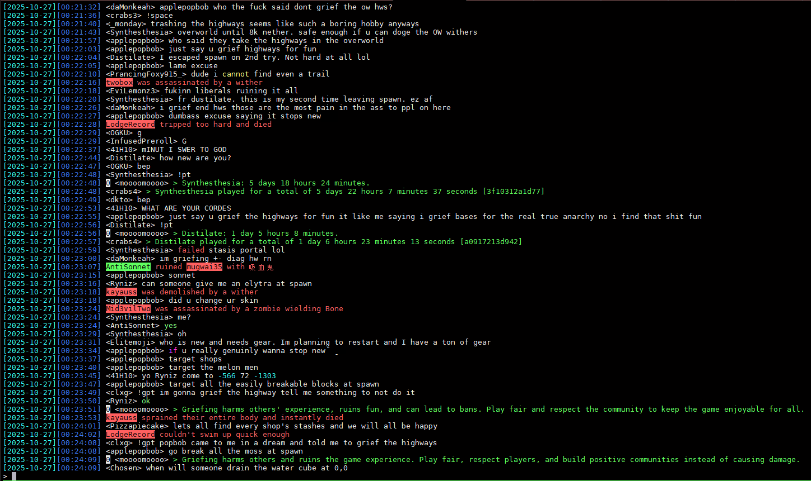

# moobot

A utility bot for anarchy minecraft servers with more than 100 commands, a database size of 50GB saving player data for more than 1.5 million Minecraft players and over 100 million messages.

Closed-source. Source code available for review upon request.

- [Engineering Challenges](#engineering-challenges)
- [Migration History](#migration-history)
- [Key Features](#Features)
- [User Commands](#moobot)
- [Admin Commands/Tools/Configuration](#admin)

# Engineering Challenges
### 2025 - Anti-anti spam
My messages were constantly getting blocked for being too similar so I added some code to check if a message was sent by the server after 2 seconds, and if it wasn't, the message is automatically resent with extra characters at the end.
### 2025 - UUID Caching
I wanted to avoid hammering the Mojang API, so I added a UUID caching system. Usernames are locked for 37 days following a name change, so I set my limit to 35 days. UUIDs are stale after 35 days and will automatically be regrabbed upon request. This resulted in much fewer api requests as I was essentially the API.
### 2025 - Discord Queuer/Grouper
Same concept of the message queuer but for discord. I added the bot to a server with nearly 30K players all chatting at the same time and there was around 10 messages every second. The discord rate limit is 4/s with 10 embeds per group. So I created the grouper and queuer which brought my limit from 4 msgs/s up to 40 msgs/s
### 2024 - Message Queuer
Originally the bot was just sending out messages whenever players sent commands, but sometimes multiple players want to run commands at once, so this feature automatically queues up messages so the bot is never limited by the antispam.
### 2024 - Server Pinger
I wanted to avoid hammering the Mojang Auth API which logged in my account everytime I tried to connect to a server. Instead of logging in, I just added a pinger which detects exactly when a server comes online and if theres more than 0 players, so I can instantly join.

# Migration History
All migration scripts have been archived and can be found in /migrationscripts
### 2025 - 2b2t.vc
I was trying to scrape 2b2t.vc for historical playerdata to fill in the missing gaps, and had to deal with rate limits. Instead of a static 10 second cooldown, I added a feature that automatically adjusted the cooldown to get the max number of requests without getting errored. I also added a feature to automatically cut new players (that haven't been checked yet) to the front of the queue so data was as accurate as possible without having to wait 2 months for all data to be scraped.
### 2025 - Removing spam
FTS-5 is essentially a copy of the messages table and takes up a ton of space. I realized there's a lot of useless spam on these servers and added a command to delete all rows containing certain phrases like discord links. This cut the database size in half.
### 2025 - FTS-5
I wanted to add a !clout command which shows how many times a phrase has been said in chat, normally this SQL query takes 10+ seconds to run as it has to go through millions of messages, but I added FTS-5 support which makes it incredibly efficient to search through text.
### 2025 - Parsing Logs
I had some missing data that was never saved which I was able to grab from the logs I kept going back to 2021. I was able to add new commands (like !joins to show how many times a player joined) and backfill the data from the logs. I also saved all death messages going back to 2021 so I could add commands like !lastdeath. I was also able to fill in missing data caused by a bug years ago that didn't save join dates for a few months.
### 2025 - Message Migration
For my messages table I was using an array of messages converted into a string for each player which wasn't ideal. I converted everything into per row and later added FTS-5 support to make searches instantaneous.
### 2021 - Massive JSON to SQLite Migration
Originally, the bot was using JSON files saved for each individual player. This is a terrible way of storing data with files randomly corrupting, and I ended up reaching the Linux file limit. Once that happened I immediately got to work and started migrating everything to an SQLite database which is much more efficient and allows for commands that would never be possible with a bunch of JSON files.
### 2019 - JSON Reformatting
Back when I first created the bot, one of the very first migrations I had to do was converting the format of the files.

# Features

### Discord chat bridge

The bot has full support in discord for cross chatting and running commands!

### Advanced player database system

The bot uses sqlite3 to store all kinds of player statistics and messages.

### Message Queuing

The bot will queue up messages so all messages can go through and the bot won't get kicked for spam.

### Discord Message Grouping

The bot automatically groups up messages (up to 10 embeds per message) to avoid getting rate limited by discord with lots of chat messages

### Anti anti spam

The bot will automatically retry messages that fail to send after a few seconds.

### Death messages

The bot will automatically save kill and death messages without requiring a regex statement. This works by checking for
usernames in the message. Use OppositeDeathMessages if the killer comes first

### Advanced regex system

The bot includes an advanced configurable regex system for custom chat regexes if the default doesn't suit your needs.

### Server pinger

The bot will automatically ping the server every 3 secs before joining to make sure it's online, has more than 0 players
online in case the main server is down, and avoids constant logins.

### Full message logging

Never miss a message with a full logging system. The bot will automatically log messages and join/leave msgs and
automatically compress log files to save space.

### Automatic TPA

The bot will automatically accept TPA requests.

### Nickname detection

When enabled the bot will automatically run /realname USERNAME for any nicknamed players.

### UUID Caching

UUIDs are cached to a database and recached after 35 days to avoid hammering the Mojang API (Minecraft usernames are
locked for 37 days before they can be taken)

### Advanced offline messaging system

All players have their own mailbox and other players are able to send them messages while they are offline so they can
recieve it once they go back online.

<h1>MooBot commands (Main commands) </h1>
<h3>Note: commands have a 5 second cooldown per user</h3>
<h3>!help - Get a help menu</h3>

<h2>Database Player Statistics</h2>

<h3> <new style="color:red">NEW</new> !bedrock</h3> Find out how many bedrock players have joined.
<h3> <new style="color:red">NEW</new> !joins or !quits</h3> Check how many times someone has joined or left (extracted from logs going back to 2021)

<h3> <new style="color:red">NEW</new> !clout / !wordcount / !wc / !word PHRASE</h3> Find out how many times a word/message has been said on the server!!!
<h3> <new style="color:red">NEW</new> !firstdeath / !fd PLAYER</h3> See your first death message (Death messages have been extracted from logs and now go back to 2021!!)
<h3> <new style="color:red">NEW</new> !firstkill / !fk PLAYER</h3> See your first kill message (Death messages have been extracted from logs and now go back to 2021!!)
<h3> <new style="color:red">NEW</new> !lastdeath / !ld PLAYER</h3> See your last death message (Death messages have been extracted from logs and now go back to 2021!!)
<h3> <new style="color:red">NEW</new> !lastkill / !lk PLAYER</h3> See your last kill message (Death messages have been extracted from logs and now go back to 2021!!)
<h3> <new style="color:red">NEW</new> !randomdeath / !rd PLAYER</h3> See a random death message (Death messages have been extracted from logs and now go back to 2021!!)
<h3> <new style="color:red">NEW</new> !randomkill / !rk PLAYER</h3> See a random kill message (Death messages have been extracted from logs and now go back to 2021!!)
 
<h3> <new style="color:red">NEW</new> !data PLAYER</h3> Download all of you or someone elses data and messages!
<h3> <new style="color:red">UPDATED</new> !top [NUMBER] [playtime/pt/deaths/kills/nolife/messages/joins/leaves] [hard/soft]</h3> Added nolife - now possible to change number
<h3> <new style="color:red">UPDATED</new> !onlinetop / !ot / !otop [NUMBER] [playtime/pt/deaths/kills/nolife/messages] [hard/soft]</h3> Added nolife - Players with the highest stats that are currently online
<h3> <new style="color:red">UPDATED</new> !quote [PLAYER] [PHRASE]</h3> Get a random message someone has said! Now a phrase can be added!
<h3> <new style="color:red">NEW</new> !newplayers 30d ago</h3> Shows amount of new players that joined before a certain time/date. 
<h3> <new style="color:red">NEW</new> !nolife</h3> Find out how much of your life was wasted playing the server, starting from firstjoin. It uses playtime divided by total time since first join. Also tells you the average time per day wasted. Command also useful for seeing moobots lifetime uptime.

<h3> !firstwords</h3> First message the bot has saved from player
<h3> !lastwords</h3> Last message the bot has saved from player
<h3> !seen / !lastseen</h3> Last time the bot has seen someone online. Also tells you how long someone has been online if they are logged in. (inaccurate if bot has disconnected while they were online)
<h3> !firstseen / !jd / !joindate</h3> First time the bot has seen someone online. - NOTE: Any firstseen times after July 10th, 2021, and before December 21st, 2021 have not been saved, and will show the most recent seen time.
<h3> !playtime or !pt</h3> Get you or someone elses playtime.
<h3> !kd or !kills or !deaths</h3> Works on nearly all servers, it checks for usernames in messages
<h3> !messages</h3> Get total messages the bot has saved from a player. (Counting all messages is not supported due to lag)
<h3> !savemsg</h3> Save a message to be played back later with !playmsg
<h3> !playmsg</h3> Play a message you saved from !savemsg
<h3> !iam</h3> Tell the bot who you are
<h3> !whois</h3> See who people are
<h3> !uuid</h3> Find a minecraft player's uuid (if server is cracked, will only show name)

<h2>Online Player Statistics</h2>

<h3> <new style="color:red">NEW</new> !players - ONLY WORKS ON DISCORD</h3> Total number of players and a list of current players online. In game, it shows the total amount of players that the bot has saved data for.
<h3> <new style="color:red">NEW</new> !bestjitter or !bestj [MINUTES]</h3> Get players with lowest jitter.
<h3> <new style="color:red">NEW</new> !worstjitter or !wj [MINUTES]</h3> Get players with highest jitter.
<h3> !ping</h3> Get ping of yourself or someone else. Now shows jitter!
<h3> !bestping or !bp</h3> Get player with lowest ping.
<h3> !worstping or !wp</h3> Get player with highest ping.

<h2>Offline Messaging System</h2>

<h3> <new style="color:red">UPDATED!</new> !offlinemsg / !om / !offlinemessage / !omsg</h3> Save a message for someone and moobot will send them the message once they are online. NOW SUPPORTS UP TO 6 MESSAGES/2 PER AUTHOR!
<h3> !ignore</h3> prevent someone from !offlinemsging you.
<h3> !unignore</h3> allow someone to !offlinemsg you.

<h2>InGame Bot Commands</h2>

<h3> <new style="color:red">NEW</new> !mount</h3> Mount any boat or minecart within 5 blocks of the bot. Warning: Anyone can find the coords of the bot, don't bring it to your base!!!
<h3> <new style="color:red">NEW</new> !dismount / !unmount</h3> Dismount from the boat or minecart.
<h3> <new style="color:red">UPDATED!</new> !time</h3> Time in ticks, and NOW tells you how long until you can sleep.
<h3> <new style="color:red">UPDATED!</new> !sleep</h3> Tells you if you can sleep or not and NOW tells you how long until you can sleep.

<h3> !radius</h3> Get all players and coordinates in radius of bot.
<h3> !coords</h3> Coords of the bot
<h3> !kill / !killbot</h3> Kill the bot.
<h3> !tps</h3> Check tps of server - NOT ACCURATE (THIS IS APPROXIMATE. IT PROBABLY ISN'T THE RIGHT NUMBER.)
<h3> !discord</h3> Get discord invite for chat bridge
<h3> !health</h3> Health and food level of bot
<h3> !runtime / !uptime</h3> Uptime of bot

<h2>Web API Commands</h2>

<h3> <new style="color:red">NEW</new> !grok / !elon / !xai</h3> Use !grok reset to reset - Ask Grok a prompt and respond with the bot
<h3> <new style="color:red">NEW</new> !gemini / !google</h3> Use !gemini reset to reset - Ask Google Gemini a prompt and respond with the bot!
<h3> <new style="color:red">UPDATED!</new> !chatgpt / !gpt / !ai</h3> Now supports message history! Use !gpt reset to reset - Ask chatgpt a prompt and respond with the bot
<h3> <new style="color:red">UPDATED!</new> !deepseek</h3> Now supports message history! Use !deepseek reset to reset - Ask deepseek (chinese gpt) a prompt and respond with the bot
<h3> <new style="color:red">NEW</new> !stock [SYMBOL] [OPTIONAL DATE&ORTIME]</h3> Get current or historical price of stock with flexible date and time option.
<h3> <new style="color:red">NEW</new> !dadjoke / !joke</h3> Get a dad joke.
<h3> !wolframalpha/!wa/!math [QUERY]</h3> Get query from <a href="https://www.wolframalpha.com">WolframAlpha</a>
<h3> !linkpreview/!link/!www [URL]</h3> Get title of any website
<h3> !down</h3> Check if a website is down
<h3> !urban or !ud</h3> Get top urban dictionary definition
<h3> !queue</h3> 2b2t queue Want to check 2b2t queue stats? <a href="https://queue.moomoo.me/">https://queue.moomoo.me/</a>
<!-- <h3> !reddit or !reddit (reddit name) (EXAMPLE: "!reddit 2b2t" or "!reddit r/2b2t")</h3> GET latest post from a subreddit (<works style="color:red">Most likely broken, 403 from reddit api.</works>) -->
<!-- <h3> !verse or !bible</h3> Get a random bible verse or add a verse at the end of the command! -->
<h3> !online EXAMPLE "!online 2b2t.org"</h3> Check how many players are online on a minecraft server.
<h3> !ip</h3> find location and isp of an ip or domain.

<h2>Fun commands</h2>

<h3> <new style="color:red">NEW</new> !blackjack</h3> Play a game of blackjack! Use !blackjack hit/stand
<h3> <new style="color:red">NEW</new> !roulette</h3> Spin a roulette wheel!
<h3> !curse</h3> Curse a player!
<h3> !ban</h3> Ban a player!
<h3> !kick</h3> Kick a player!
<h3> !mute</h3> Mute a player!
<h3> !report</h3> Report someone to server moderators for breaking the rules.
<h3> !rules</h3> Rules of the server
<h3> !no</h3> NO
<h3> !yes</h3> YES
<h3> !dupe</h3> dupe an item!
<h3> !locate</h3> get someones coords! 100% working 2020
<h3> !y/n</h3> Yes or no
<h3> !dice</h3> Roll a die
<h3> !leak</h3> Leak coords
<h3> !gm / !gamemode</h3> Change your gamemode
<h3> !infect</h3> infect someone.
<h3> !ask</h3> ask
<h3> !give</h3> give someone something
<h3> !teleport</h3> teleport!
<h3> !back</h3> go back
<h3> !op</h3> Op yourself or someone else
<h3> !tpa</h3> Request teleport to someone
<h3> !tphere / !tpahere</h3> Request someone to teleport to you
<h3> !tpaccept</h3> Accept a teleport request
<h3> !tpdeny</h3> Deny a teleport request
<h3> !sethome</h3> Set your home
<h3> !home</h3> go to your home
<h3> !execute</h3> start a vote to execute someone, use /kill yes or /kill no to vote.
<h3> !bless</h3> bless someone. You are a good person.
<h3> !kit</h3> recieve a kit!

<h1>Admin</h1>

<h2>Discord Admin Commands</h2>

### !ignorephrase
Permanently ignore a phrase in chat, saved to blockedphrases.json
### !ignoredeath
Permanently ignore a players death messages in chat, saved to blockeddeaths.json
### !restart
Run process.exit and restart bot

<h2>Terminal Commands</h2>

### /hide
Hide death messages and join/leave messages
### /ignorephrase
Permanently ignore a phrase in chat, saved to blockedphrases.json
### /ignoredeath
Permanently ignore a players death messages in chat, saved to blockeddeaths.json
### /qmsg
Add a message to the queue, so you aren't hitting antispam limits.
### /toggleconnectionmsgs
Enable client side connection messages if server doesn't have them.
### /delete
Delete all messages associated with certain phrases. For example deleting discord advertisements can save tons of storage.

<h2>Scripts</h2>

### backup.sh
Run a backup of all moobot instances, it vacuums into a new file and the rsyncs it to another server.
### backupcold.sh
Run a cold backup of all moobot instances; Meaning data is dumped into txt files and then compressed to save storage, often 80% less.
### compresslogs.sh
MooBot automatically compresses logs on start, but this is if you need to manually compress logs.
### copyFile.sh
I have 20 different instances, so this makes it easy to copy new code to all 20 at once.
### rmFile.sh
Remove a file from all instances.
### updateAll.sh
This file updates packages for all instances.
### vacuum.js
Vacuum all databases

<h2>Config Options</h2>

### ip
Server ip
### port
Server port
### version
Server version
### prefix
Command prefix (!)
### cracked
Enable if server is cracked to not use uuids
### cracked_login
Login for cracked server
### discordprefix
Discord command prefix
### chatchannels
Array of all chat channels, make sure you also fill guilds
### guilds
Array of all guilds, make sure both chatchannels and guilds are in the same index [0,1] etc
### moreprefixes
If you want to give players more prefix options
### commandchannels
Not generally needed as users can run commands in chat channels.
### disabledcommands
Disable any commands you don't want players to be able to use
### ownerid
Specify owner id for access to some special commands.
### DisableAFK
Disable the default anti-afk system
### EnableMorePrefixes
Enable more prefixes from moreprefixes
### messageinterval
How often to make announcements from messages.json
### cooldowntime
Command cooldown per player
### GlobalCooldown
Enable a global cooldown, not recommended since you can queue up messages instead
### GlobalCooldownTime
How long to wait in between commands from all players
### whispercooldowntime
Cooldown time for whispers
### RemoveYellowJoinMessages
Remove the default join messages
### WalkForwardOnJoin
Walk forward to bypass antispam
### WalkConstantly
Constantly walk in a circle - not recommended as anticheats don't like it
### DeathConstantly
Constantly kill your player, may help bypass antiafks
### DeathTime
How often to kill your player
### DeathCommand
Death command /kill
### DeathOnJoin
May help get you unstuck
### CharacterLimit
Max characters that can be sent in a message, any more will get cut off
### DefaultMineflayerChatRegex
Use the default regex system for mineflayer
### newversionchatfix
Experimental
### purityvanilla
Experimental
### AlternativeChatRegexSystem
Useful for servers with janky chat plugins that don't use the typical format.
### CustomWhisperRegex
Custom whisper regex
### HideErrors
Hide Mineflayer errors
### LeaveOnMessage
Automatically restart the bot when it finds a message in chat
### LoginCommandEnabled
Whether to enable a command upon login
### LoginCommand
Specified command to run upon login
### LoginCommand2
Another command if needed
### LoginCommandSeconds
How long to wait before sending login command
### PingerDisabled
Disable the server pinger, not recommended as the bot will constantly be hammering mojang auth
### PingerTime
How often to ping server if its down
### MaxPlayerLimit
Useful if server is at full capacity with no queue and you need to bruteforce your way in
### PingerMaxPlayers
Maximum players before bot will not connect
### MinPlayerLimitDisabled
Whether to allow the bot to join no matter how few players are online
### MinPlayerLimit
Don't allow the bot to join if there's no one online, will automatically ping and join once it detects someone.
### whisperOnly
Whether the bot will only whisper command responses, useful to avoid getting muted.
### whisperCommmand
Command used for whispering, default /w. If your server uses a different command, specify here.
### tpaAcceptMsg
Message to send when receiving a tpa request to accept.
### TriggerMessage
Enable a message that gets triggered from a regex
### TriggerCommand
Command ran after recieving a specific message.
### EnableChatReporting
Enable chat reporting, note you may be reported. Recommend to only use the bot on servers that disable it.
### DisableMessageQueuing
Not recommended - Instead of queueing messages, the bot will send them all at once
### MessageQueueTime
How long in between messages queued.
### MaxMessagesInQueue
How many messages can be queued up
### DiscordQueueDisabled
Not recommended. Whether to disable the discord message grouping queue.
### DiscordQueueTime
How often in between discord embeds, which group up to 10 messages each.
### BlockedPhrases
Specific phrases to block
### UseNicknames
Whether to automatically check players for nicknames if their name doesn't show up in player list.
### MailboxLimit
Max messages per mailbox
### AuthorMailboxLimit
How many messages can be sent to one player from someone
### OppositeDeathMessages
Whether to reverse death messages based on server.
### AntiSpamBypass
Automatically append random string to the end if message isn't sent after 2 seconds
### UUIDForMissingPlayers
Check Mojang api for uuid if they can't be found in the player list
### DisableHeartbeatCheck
Disable checking to make sure the bot is still on the server and not in limbo
### 2b2t
2b2t options
### regex
Regex strings. tpa1, tpa2, cracked_login_pattern, chat, whisper, leavemessage, triggermessage

